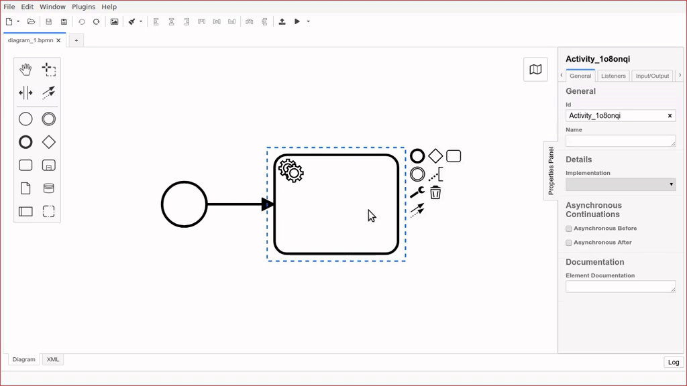
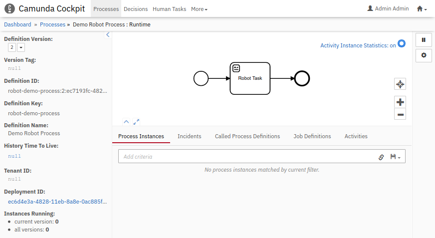

# Camunda Modeler Robot Framework Plugin

[](https://github.com/camunda/camunda-modeler)

This example is based on [Camunda Modeler Plugin Example](https://github.com/camunda/camunda-modeler-plugin-example/).

## Features

* Renders Robot Framework icon for service tasks with `robot` in their task id (case insensitive).



## Development Setup

Use [npm](https://www.npmjs.com/), the [Node.js](https://nodejs.org/en/) package manager to download and install required dependencies:

```sh
npm install
```

To make the Camunda Modeler aware of your plug-in you must link the plug-in to the [Camunda Modeler plug-in directory](https://github.com/camunda/camunda-modeler/tree/develop/docs/plugins#plugging-into-the-camunda-modeler) via a symbolic link.
Available utilities to do that are [`mklink /d`](https://docs.microsoft.com/en-us/windows-server/administration/windows-commands/mklink) on Windows and [`ln -s`](https://linux.die.net/man/1/ln) on MacOS / Linux.

Re-start the app in order to recognize the newly linked plug-in.


## Building the Plug-in

You may spawn the development setup to watch source files and re-build the client plug-in on changes:

```sh
npm run dev
```

Given you've setup and linked your plug-in [as explained above](#development-setup), you should be able to reload the modeler to pick up plug-in changes. To do so, open the app's built in development toos via `F12`. Then, within the development tools press the reload shortcuts `CTRL + R` or `CMD + R` to reload the app.


To prepare the plug-in for release, executing all necessary steps, run:

```sh
npm run all
```

## Cockpit plugin

The build results also a Camunda Cockpit compatible bpmn-js extension module at `./dist/module.js`. Please, follow the [Camunda Cockpit plugins guide](https://docs.camunda.org/manual/latest/webapps/cockpit/extend/plugins/) on how to copy `./dist/module.js` into a proper location depending on your Camunda distribution, and how to configure it as a bpmn-js extension, e.g.:

```JSON
  bpmnJs: {
    additionalModules: [
      'scripts/robot-module.js'
    ]
 }
```



## Licence

MIT
